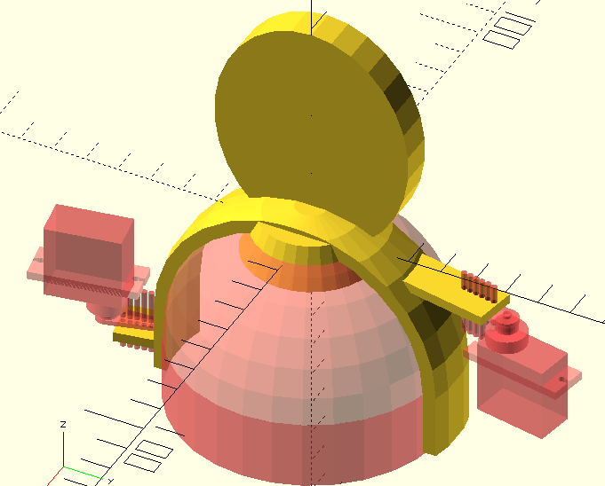

# パペット用フレーム例

## 概要

ネットワークカメラ(以下カメラ)「TS-NS310W」にパペットを被せて固定する為の骨格例です。  

## 構成

- `tsns310w_puppet.scad`： 3D CAD(OpenSCAD)データ
- `tsns310w_puppet.stl` ： 3Dプリンター印刷用データ

## 利用方法

- フレームの作成  
利用パペットやサーボ取り付け位置(用途)に合わせてフレーム（骨格）を作成します。
紙粘土や針金等を利用し作成する事もできます。  
デモで作成したCADデータを参考にしたり、再利用する事もできます。

- パペットにレンズ穴を開け  
パペット機能とカメラ機能を両立する為に、パペットにレンズ用穴を開けます。
作成したフレームにパペットを取り付け、カメラのレンズ位置に印を付けます。
レンズ位置周辺の生地を瞬間接着剤等で固め、彫刻刀(半丸）で打ち抜きます。

## 開発環境  

- OpenSCAD

## 対応カメラ  

- TS-NA310W

## 注意事項

- 製品保証外の使い方です。  

- 作り方によっては故障の原因になります。  

- 骨格・パペットを含め軽く作る事をオススメします。

## ライセンス

ライセンスについては、[LICENSE](../../LICENSE)をご確認ください。 

