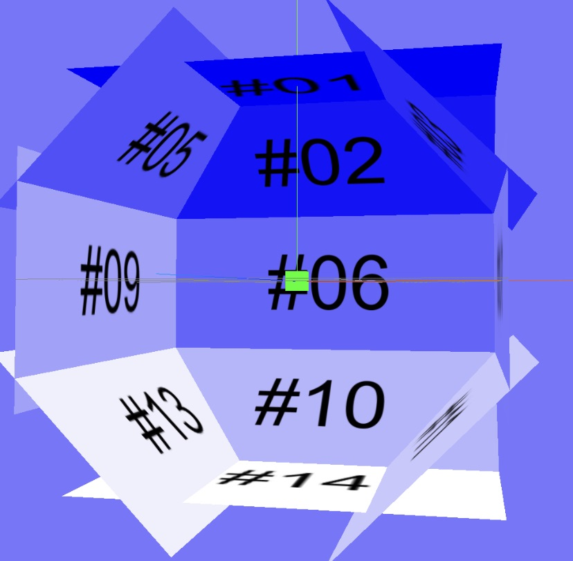

# SampleCode_VR

## 概要

このサンプルでは、ネットワークカメラ(以下カメラ)「TS-NS310W」で360度全天VRを実現する方法を説明します。
カメラAPIで向きを指定した撮影を繰り返し全天の画像を取得し、仮想空間に画像を並べる事で実現します。
スマートフォンの加速度センサー連動で、スマホの向きに連動した視聴ができます。

動作例は[Youtube動画](https://www.youtube.com/watch?v=ahM26jYdykI)を参照ください。

Impress社のINTERNET Watch記事で「技術の無駄遣い」として紹介されました。

## 構成

- `www/vr.html` : ①トップページ
- `www/images/getimage.bat` : ②撮影と画像取得BATファイル
- `www/images/getimage.sh` : ③撮影と画像取得シェルスクリプト
- `www/images/*.jpg` : : ④撮影された画像
- `www/js/panoramaViewer.js` : ⑤VR表示部
- `www/js/*.js` : ⑥利用ライブラリ群

撮影画像の配置例

## 準備

- 署名証明書の準備
opensslコマンドを導入し、自己署名証明書を生成します。
  > 例：生成コマンド
  openssl req -new -x509 -keyout cert.key -out cert.pem -days 365 -nodes  

- HTTPS対応WebServerの準備
  設定でルートディレクトリ設定と、生成した証明書ファイルを登録します。
  > 例：Niginxの場合
  "nginx.conf"ファイル内で、"root"でルートディレクトリを確認または変更
  "nginx.conf"ファイル内で、"ssl_certificate"および"ssl_certificate_key"で証明書パスを確認または変更

- サンプルコードの導入
フォルダーの内容をWebServerの公開ディレクトリにコピーします。

- カメラの管理者IDとパスワードとIPアドレスを確認  
管理者IDは`admin`パスワードは設置時に設定した値です。
IPアドレスは弊社アプリ[MagicalFinder](https://www.iodata.jp/lib/software/m/1551.htm)で調べる事ができます。  

- スクリプトの修正
②または③にカメラの管理者IDとパスワードとIPアドレスを記載します。
Winodwsは②を、macOSやLinucは③を編集します。
  > idpass=admin:abcd1234 ※コロン“:”の前がID、後がパスワード
  host=192.168.0.28 ※IPアドレス

## 利用方法

- WebServerを起動

- スクリプトで撮影
カメラAPIでパンチルトを行い撮影画像取得します。
Winodwsは②を、macOSやLinucは③を起動します。

- 視聴
視聴端末でWebServerのIPアドレスを開きます。
加速度センサーを連動させるには必ずHTTPSでアクセスしてください。
`https://<IPアドレス>/`
加速度センサー連動または画像のドラッグで表示向きを変える事ができます。
**※注意**
自己署名証明書でHTTPS接続する場合、ブラウザに警告が表示されます。
接続先が正しい事を確認し許可を許可をしてください。

## 開発環境  

- HTTPS対応WebServer(NginX等)

- OpenSSL

## 対応カメラ  

- TS-NS310W  

## 注意事項

- カメラの稼働範囲の都合で、真下を撮影できません

- スマホのセンサー連動はHTTPSアクセス(署名証明書が必要)時のみご利用できます

- カメラの初期設定を済ませてから本サンプルプログラムをお使いください

- 本サンプルはローカル環境にあるカメラのみで利用可能です。

## 応用

VR体験は場所や時間を工夫するだけで、さまざまな体験ができます。

- 外で撮影し室内で見る「透視体験」
- 何が変わったか探し出す「間違い探しゲーム」
- かごの中で撮影する「ペット視点体験」
- 時間変化・季節変化を感じる「早送り再生」

etc.

## ライセンス

ライセンスについては、[LICENSE](../../LICENSE)をご確認ください。

