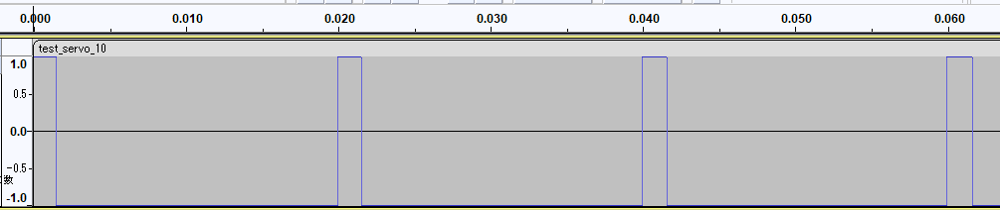

# サーボ駆動用音声データ生成

## 概要

ラジコン用サーボ（以下サーボ）を動かす音声信号を生成する方法です。  
ネットワークカメラ（以下カメラ）「TS-NS310W」の音声出力でサーボを動かすことができます。  

## 構成

- `ServoAudio_xx.py`

## 準備

- 動作環境の作成

- サンプルコードをパソコンへコピー

## 利用方法

- python3で本スクリプトを起動  
　カスタマイズしてサーボの動きを変えることもできます。

- 生成されたWAVファイルをMP3またはAACに変換

- 作成ファイルをカメラの設定画面からアップロード  
設定画面の再生機能でサーボを動かす事もできます。

＜参考＞生成した音声データ

## 動作環境  

- python3.x

- WAVをMP3かAACに変換できるアプリケーション

## 対応カメラ  

- TS-NS310W  

## 対応音声ファイル

TS-NS310W :  

- フォーマット：mp3またはaac
- 周波数：44.1kHzまたは48kHz
- ビットレート：16～128kbps
- ファイルサイズ：1MBまで

詳しくは、設定画面および説明書等を参照ください。

## 注意事項

- 音声ファイルのカメラの未対応フォーマットがの場合は音を出力できません

- 本スクリプトで生成されるデータはWAV形式です  
カメラにアップロードする場合は任意ソフトで対応フォーマット変換してください。

- カメラの通話用APIを利用しサーボを動かす事も可能です。

## ライセンス

ライセンスについては、[LICENSE](../../../LICENSE)をご確認ください。
