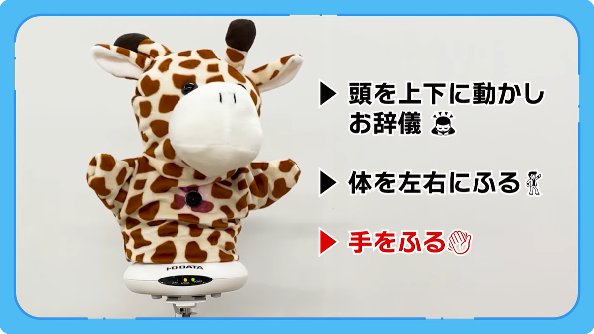

# SampleCode_Puppet

## 概要

このサンプルでは、ネットワークカメラ（以下カメラ）「TS-NS310W」に被せたパペットを動かす方法を説明します。
パペット全体をカメラAPIの首振り機能で動かし、パペットの手をカメラAPIの音声再生機能でラジコンサーボ（以下サーボ）を動かします。

動作例は[Youtube動画](https://www.youtube.com/watch?v=QgdXpl9iVIc)を参照ください。

Impress社の[INTERNET Watch記事](https://internet.watch.impress.co.jp/docs/topic/shimizu_sp/1538426.html)で「技術の無駄遣い」として紹介されました。

## 構成

- `Frame`   ： パペットを支えるフレーム作成
- `Script`  ： パペットを動かすスクリプト
- `Audio`   ： サーボ駆動用音声データ作成

## 準備

- パペットを被せる場合、`Frame`フォルダーを参照
- パペットやサーボを動かす場合、`Script`フォルダーを参照
- サーボ用音声を作る場合、`Audio`フォルダーを参照

## 対応カメラ  

- TS-NS310W  

## 応用

手を動かす代わりにできること。

- しっぽを振る
- パーティークラッカーを鳴らす
- 輪ゴム鉄砲を撃つ
- びっくりチキンを鳴らす
- 壁の照明スイッチを操作する
- 車輪を動かす
