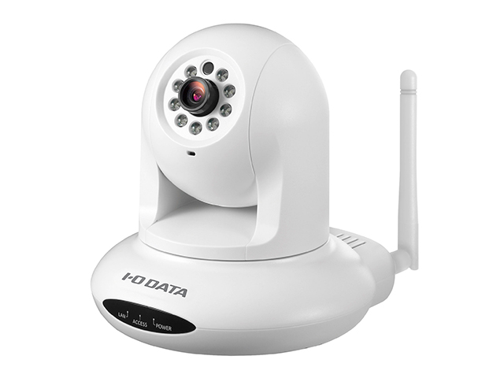
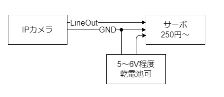

# スクリプト



## 概要

ネットワークカメラ（以下カメラ）「TS-NS310W」に被せたパペットをカメラAPIで動かすスクリプトです。  
APIで座標を指定したパンチルト制御と、音声出力によるラジコンサーボ（以下サーボ）制御を行います。  
ラジコンサーボを利用するにはライン出力にサーボを接続します。  

## 構成

- `girafe.bat`  ： ①パペットを動かすBATファイル
- `girafe.sh`   ： ②パペットを動かすシェルスクリプトファイル
- `*.mp3`       ： ③サーボ用音声データ

## 準備

### ハードウェア

- カメラとサーボの接続は下記を参考にしてください。  
  
実施例でカメラのライン出力に2台のサーボを並列に接続し動かしています。  
利用するサーボによっては強力な電源が必要になる場合があります。  
サーボを無信号状態でも利用する為、挙動の安定しやすいデジタルサーボをオススメします。  

### ソフトウェア

- 本フォルダーをパソコンへコピー

- カメラの管理者IDとパスワードとIPアドレスを確認  
管理者IDは`admin`パスワードは設置時に設定した値です。  
現在のIPアドレスは弊社アプリケーション[MagicalFinder](https://www.iodata.jp/lib/software/m/1551.htm)で簡単に調べる事ができます。  

- カメラにサーボ用音声データをアップロード  
Web設定画面⇒「ビデオ・サウンド」⇒「サウンド」からPC上のファイルを選択し追加してください。  
導入した音声データを選択し「テスト」ボタンを使って、サーボを動かす事もできます。  

- 音声データのインデックス番号を取得  
下記を参考に音声データのリストを取得し、導入音声データのインデックス番号を取得します。  
  ```http://<IP Address>/camera-cgi/admin/param.cgi?action=StorageMusicInfo```  
  取得したインデックス番号を指定し、再生する事ができます。  例は"3"を指定。  
  ```http://<IP Address>/camera-cgi/admin/param.cgi?action=MusicCtrl&MusicPlay=3```  

- スクリプトファイルの修正  
パソコンがWindowsの場合は①、macOSやLinux等の場合には②を使います。  
カメラの設定情報をスクリプトに記載します。  
  - IDとパスワードを指定  
  ```idpass```に```<ID>:<パスワード>```を指定します。  
  - IPアドレスを指定  
  ```host```に```<xxx.xxx.xxx.xxx>```を指定します。  
  - インデックス番号を指定  
  ```index```に音声データのインデックス番号を指定します。  

## 利用方法

パソコンで利用するスクリプトを起動します。  
カメラが動き出す事を確認します。  

## 動作環境  

- cURLコマンドが動作する環境  
  WindowsはWindows 10以降でcurl.exeが標準で利用できます。  
  cURL以外でもAPIを利用する事ができます。  

- Magical Finderが動作する環境  

## 対応カメラ  

- TS-NS310W  

## 対応音声ファイル  

TS-NS310W :  

- フォーマット：mp3またはaac
- 周波数：44.1kHzまたは48kHz
- ビットレート：16～128kbps
- ファイルサイズ：1MBまで

## 注意事項

- 本サンプルプログラムでは、APIの送信にcURLを使用しています。
- カメラの初期設定を済ませてから本サンプルプログラムをお使いください。
- 本サンプルはローカル環境にあるカメラのみ設定が可能です。

## ライセンス

ライセンスについては、[LICENSE](../../../LICENSE)をご確認ください。
